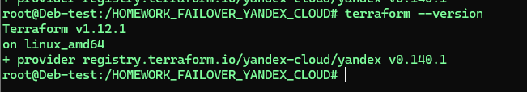
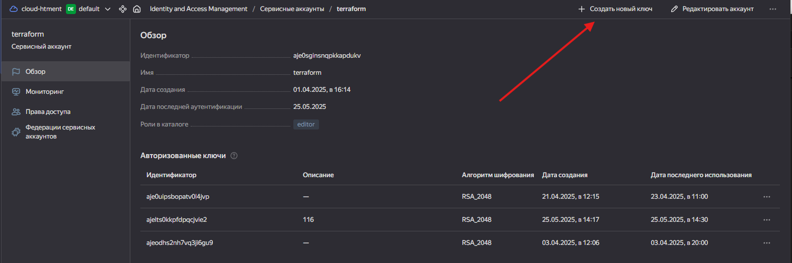
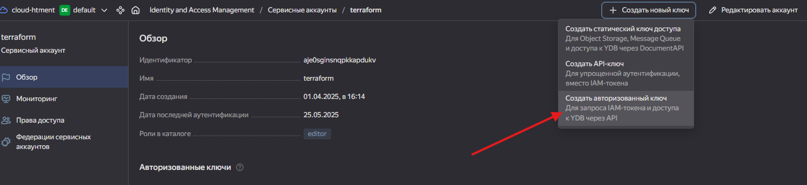
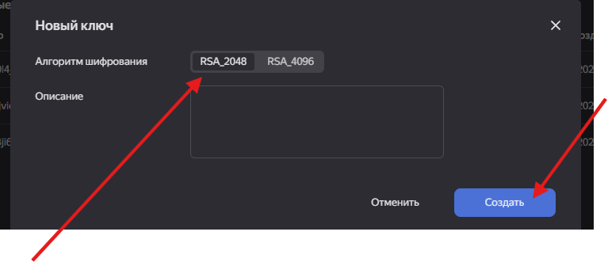
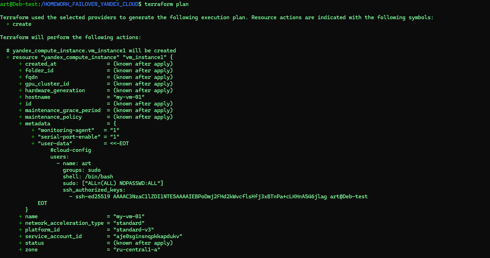
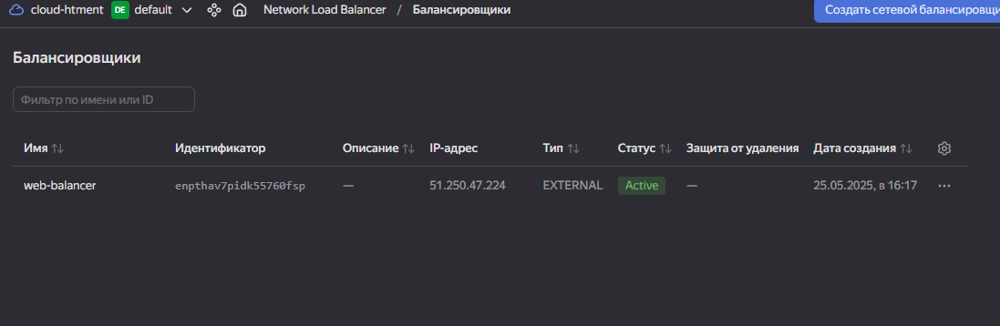
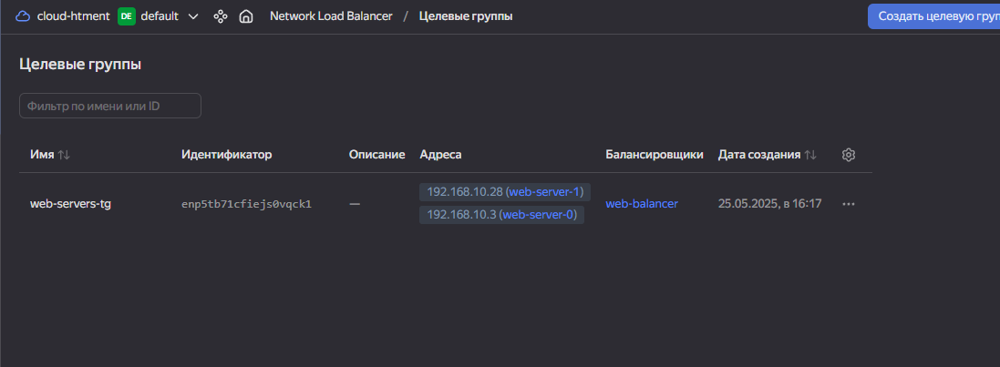
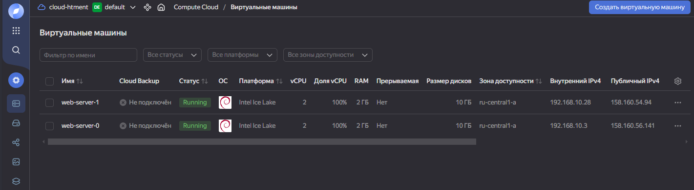
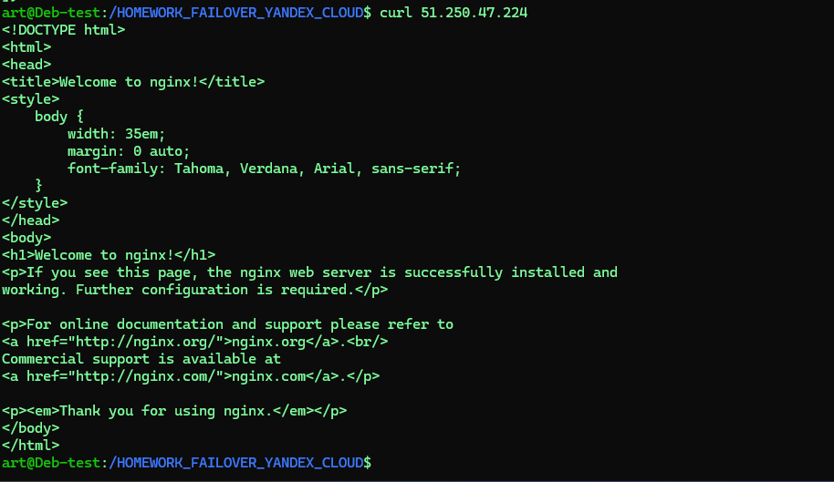

# Установим Terraform

`` wget https://hashicorp-releases.yandexcloud.net/terraform/1.12.1/terraform_1.12.1_linux_amd64.zip``

`` unzip terraform_1.12.1_linux_amd64.zip``

```
rm -rf ~/.tfenv
sed -i '/tfenv/d' ~/.bashrc
exec $SHELL  # Перезагружаем оболочку
```


## Убедимся, что файл terraform существует в текущей директории
ls -la terraform

## Если файл есть, устанавливаем его правильно

```
sudo install -m 0755 terraform /usr/local/bin/
```

```
which terraform  # Должно показать /usr/local/bin/terraform
terraform --version  # Теперь должно работать
```




```
rm -rf .terraform .terraform.lock.hcl  # Удаляем кеш и lock-файл
terraform init                         # Инициализируем заново

```






дальше скачиваем  authorized_key.json

в начало main.tf прописываем блок:

```
 terraform {
     required_providers {
       yandex = {
         source  = "yandex-cloud/yandex"
         version = "~> 0.140.1"
       }
     }
   }

   provider "yandex" {
     cloud_id  = var.cloud_id
     folder_id = var.folder_id
     service_account_key_file = file("./authorized_key.json")
   }
```
далее создаем:
terraform.tfvars

```
terraform init
```

Команда скачает провайдер и сохранит его в .terraform/providers/.


 ## проверяем 
 ``terraform plan``




Проверяем что создалось





проверяем балансировку делаем curl на 80 порт

```curl 51.250.47.224```




можно заменить ресурс ``yandex_compute_instance`` на ``yandex_compute_instance_group`` и использовать аналогичный подход с балансировщиком.